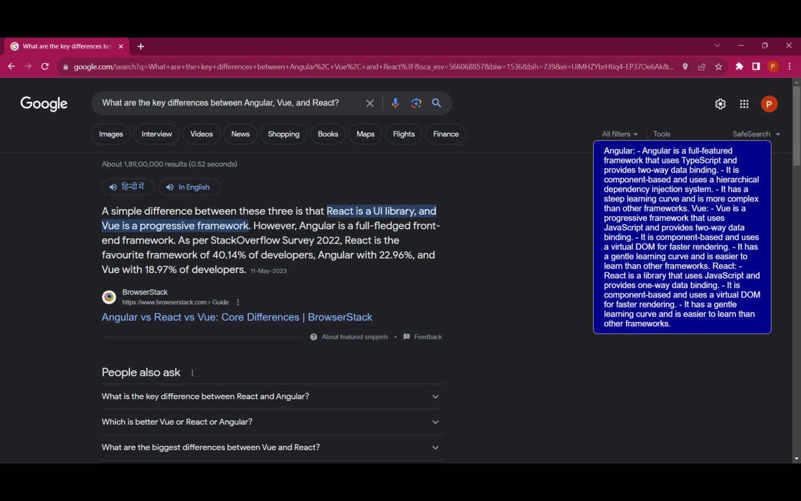
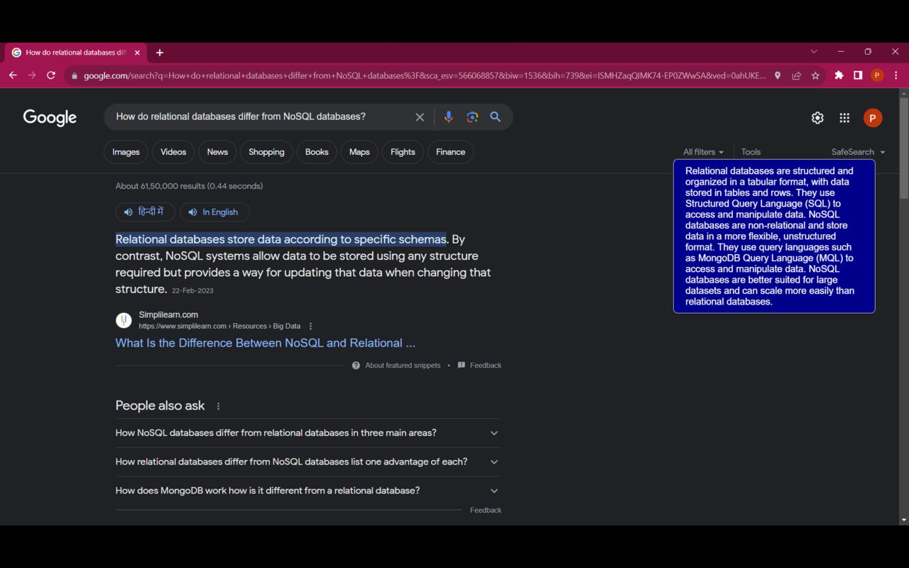
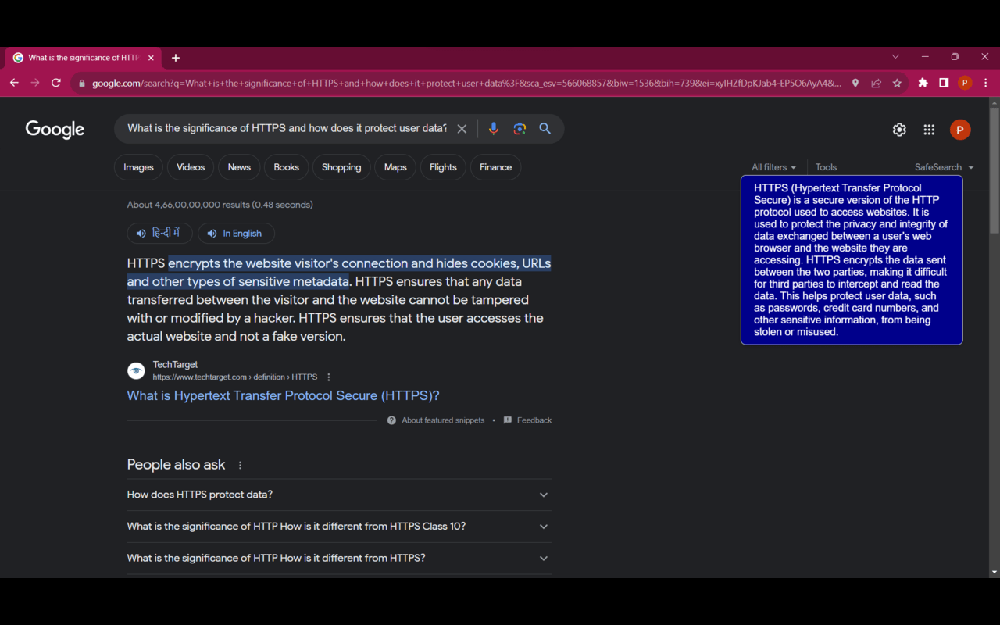

# Insightly - Chrome Extension 🌐✨

Insightly is a Chrome extension designed to provide AI-powered insights from ChatGPT directly within your Google search results. Enhance your search experience with deeper understanding, all without leaving your search page.

 

## Features 🌟

- **AI-Enhanced Google Search**: Receive relevant insights, suggestions, or deeper explanations from ChatGPT for your search queries.
- **Seamless User Experience**: Integrated directly within Google search, no additional pop-ups or interfaces.
- **Clean and Elegant Design**: Dark blue widget displaying insights with white text, designed to be both aesthetic and readable.
- **Privacy-Centric**: No user data is collected, stored, or shared. Your searches remain private.

## Screenshots 🖼️








## Installation and Usage 🔧

1. **Clone this Repository**:
    ```bash
    git clone https://github.com/prakhar-ktyr/Insightly.git
    ```

2. **Load the Extension to Chrome**:
    - Open Chrome and navigate to `chrome://extensions/`.
    - Enable "Developer mode".
    - Click on "Load unpacked" and select the directory where you cloned this repository.

3. **Use Google as You Normally Would**: 
    - Type in your search query on Google.
    - Observe AI-generated insights from ChatGPT on the right side of your search results.

## Feedback and Contributions 💌

If you have feedback, issues, or would like to contribute to the project, feel free to open an issue or make a pull request on this repository.

## License 📝

MIT License. See `LICENSE` in this repository for details.
